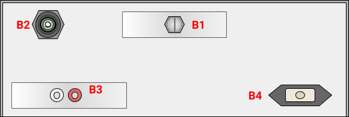

# IEC Pressure Endurance Test Fixture

This document will describe the steps for basic usage of the fixture

## Physical Setup

The phyical setup of the fixture includes a Raspberry Pi 3 Model B with the Primroni Automation Hat as the control device. The pneumatic setup of the fixture includes an aquarium pump conntected to an accumulator, to reduces perssure surges, the output of which is split between the Unit Under Test and a variable flow controlled vent to atmosphere. Proper pressure can be achieved by varying the flow rate to atmosphere. The UUT pressure is switched by a 120V AC solenoid, driven by a relay switched by the Raspberry Pi, as documented below.

## Physical UI

|  |
| :---: |
| _Front Face of Fixture_ |

|  |
| :---: |
| _Back Face of Fixture_ |

## Web UI

