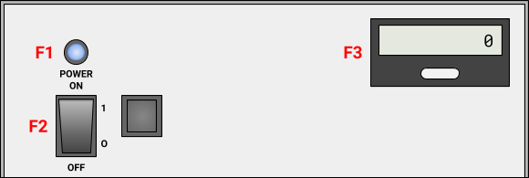

# IEC Pressure Endurance Test Fixture
This document will describe the steps for basic usage of the fixture
## Physical Setup
The physical setup of the test fixture.
|  |
| :---: |
| _Front Face of Fixture_ |

|  |
| :---: |
| _Back Face of Fixture_ |

